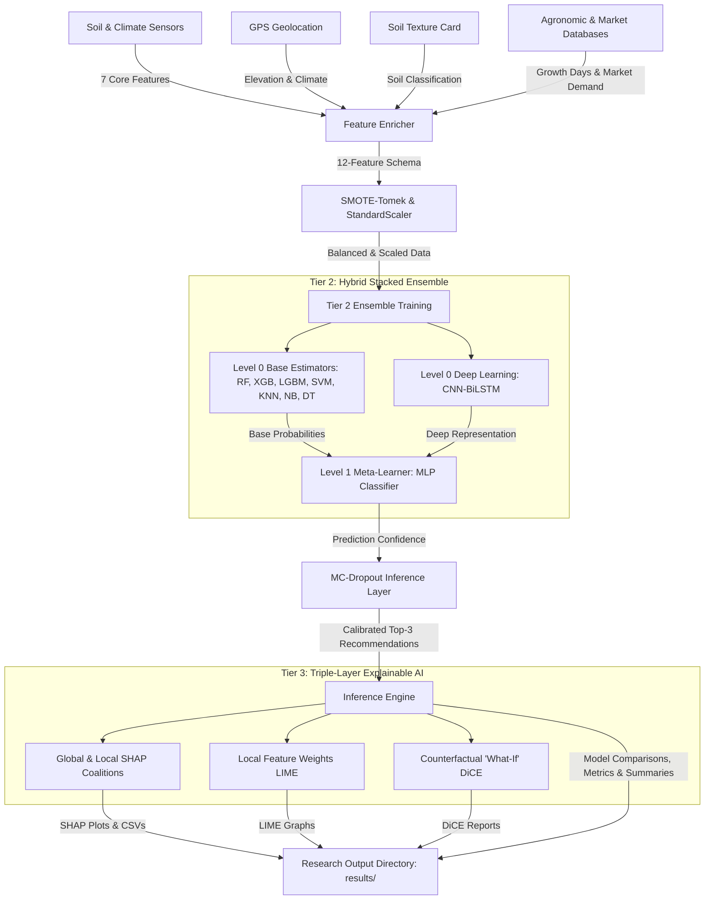

# 🌾 Advanced Crop Recommendation System (ACRS) — Architecture & Technical Specifications

This document provides a comprehensive breakdown of the **Advanced Crop Recommendation System (ACRS)**. It details the system's end-to-end architecture, academic research justifications, machine learning design decisions, and core codebase components. 

---

## 📋 Table of Contents
1. [Research Context & Motivation](#1-research-context--motivation)
2. [Key Academic Contributions](#2-key-academic-contributions)
3. [System Architecture Overview](#3-system-architecture-overview)
4. [Tier 1: Multi-Source Feature Engineering (12-Feature Schema)](#4-tier-1-multi-source-feature-engineering-12-feature-schema)
5. [Tier 2: Two-Tier Stacked Hybrid Ensemble Model](#5-tier-2-two-tier-stacked-hybrid-ensemble-model)
6. [Tier 3: Triple-Layer Explainable AI (XAI) Architecture](#6-tier-3-triple-layer-explainable-ai-xai-architecture)
7. [Tier 4: CLI Execution & Interactive Inference](#7-tier-4-cli-execution--interactive-inference)
8. [Codebase File & Directory Specifications](#8-codebase-file--directory-specifications)
9. [Experimental Design & Evaluation Protocol](#9-experimental-design--evaluation-protocol)
10. [Academic Journal Targeting & Publishing Strategy](#10-academic-journal-targeting--publishing-strategy)

---

## 1. Research Context & Motivation
Modern crop recommendation systems consistently suffer from key scientific and practical limitations in the published literature (2015–2025):
1. **Single-Algorithm Limitations**: Relying on single, static classifiers (e.g., Random Forest or SVM) that fail to capture the multi-dimensional, non-linear boundaries of high-dimensional agronomic data.
2. **"Black Box" Lack of Trust**: Presenting highly accurate predictions without providing explanations. Farmers and agricultural extension workers will not trust recommendations without understanding the driving factors.
3. **Narrow Feature Benchmarks**: The standard agricultural benchmark dataset relies on a simple **7-feature schema** (Nitrogen, Phosphorus, Potassium, temperature, humidity, pH, and rainfall), ignoring geographic, economic, and physiological dimensions.
4. **Lack of Uncertainty Calibration**: Recommending crops as absolute certainties without quantifying model confidence under out-of-distribution or noisy sensor environments.

**ACRS** resolves these limitations by designing a robust, reproducible, and highly modular pipeline that introduces a two-tier stacked ML-DL ensemble, a triple-layer XAI framework, a 12-feature extended data model, and Monte Carlo Dropout uncertainty estimation.

---

## 2. Key Academic Contributions
The ACRS project contributes to precision agriculture research in the following ways:
* **Hybrid Two-Tier Stacked Ensemble**: Combines diverse classical ML estimators (RF, XGBoost, LightGBM, SVM, KNN, NB, DT) with deep neural networks (CNN-BiLSTM / MLP) feeding into an MLP meta-learner.
* **Triple-Layer Explainability**: Offers a comprehensive interpretability suite featuring **SHAP** (global and local coalitions), **LIME** (local linear approximations), and **DiCE** (diverse counterfactual instances).
* **Extended 12-Feature Schema**: enriches the baseline 7 features with **5 new variables**: Elevation, Climate Zone, Soil Texture, Growth Days, and Market Demand.
* **Monte Carlo Dropout Uncertainty**: Employs MC-Dropout at inference time to generate top-3 ranked recommendations backed by calibrated confidence distributions.
* **SMOTE-Tomek Class Balancing**: Integrates synthetic minority over-sampling with Tomek links to resolve class imbalances, verified using the **Matthews Correlation Coefficient (MCC)**.

---

## 3. System Architecture Overview



---

## 4. Tier 1: Multi-Source Feature Engineering (12-Feature Schema)
To outperform baseline crop recommendation systems, ACRS enriches the standard Kaggle dataset with 5 additional critical factors:

| Feature Name | Type | Description | Source / Acquisition Method | Scientific Rationale |
| :--- | :--- | :--- | :--- | :--- |
| **Nitrogen (N)** | Chemical | Nitrogen concentration in soil (mg/kg) | NPK sensor | Key vegetative growth driver |
| **Phosphorus (P)** | Chemical | Phosphorus concentration in soil (mg/kg) | NPK sensor | Root development stimulant |
| **Potassium (K)** | Chemical | Potassium concentration in soil (mg/kg) | NPK sensor | Disease resistance and water regulation |
| **pH** | Chemical | Soil acidity/alkalinity scale (0–14) | pH probe sensor | Controls soil nutrient availability |
| **Temperature** | Climate | Ambient air temperature (°C) | DHT22 sensor / weather API | Direct regulator of plant metabolic rates |
| **Humidity** | Climate | Relative humidity (%) | DHT22 sensor / weather API | Impacts plant transpiration and moisture retention |
| **Rainfall** | Climate | Seasonal / annual rainfall (mm) | Rain gauge sensor / weather API | Basic water resource availability indicator |
| **Elevation** | Geographic | Altitude above sea level (m) | GPS coordinates & SRTM API | Controls local atmospheric pressure and UV exposure |
| **Climate Zone** | Geographic | Categorical zone classification (1–4) | Coordinates mapped to Köppen-Geiger | Distinguishes arid, tropical, temperate, and cold regions |
| **Soil Texture**| Physical | Clay, sand, loam proportion indices (1–3) | Geotechnical records / CNN Classifier | Influences water-holding capacity and aeration |
| **Growth Days** | Biological | Average growth period duration | Crop cycle database | Validates seasonal window compatibility |
| **Market Demand**| Economic | Normalized market value index (0.0–1.0) | Local crop market API | Ensures economic viability of recommendations |

---

## 5. Tier 2: Two-Tier Stacked Hybrid Ensemble Model
The core predictive engine uses a hybrid hierarchical ensemble designed to achieve low variance and high stability.

### Level-0 Base Classifiers (Tier 1 Estimators)
ACRS trains seven heterogeneous base estimators spanning multiple mathematical methodologies:
1. **Random Forest (RF)**: Bagging-based decision forest (low variance, high robust features).
2. **XGBoost**: Regularized gradient boosting (high speed, handles complex boundaries).
3. **LightGBM**: Fast leaf-wise histogram boosting (highly efficient, low memory).
4. **Support Vector Classifier (SVC)**: Kernel-based margin maximizer (ideal for high-dimensional support vectors).
5. **K-Nearest Neighbors (KNN)**: Distance-based local density estimator.
6. **Naive Bayes (NB)**: Probabilistic joint feature modeling (acts as a baseline).
7. **Decision Tree (DT)**: Base high-variance estimator.

### Level-0 Deep Learner (Tier 2 Estimator)
* **CNN-BiLSTM Hybrid**: For environments with sequential and deep tabular representation needs, this model extracts spatial characteristics via a 1D Convolutional Neural Network followed by sequential pattern analysis with Bidirectional LSTM layers.
* **Graceful Fallback Mechanism**: The system automatically detects Python and TensorFlow compatibility (e.g., in Python 3.14+). If TensorFlow is unavailable, the pipeline scales down smoothly to a highly optimized scikit-learn **Multi-Layer Perceptron (MLP) Meta-Learner** without crashing.

### Level-1 Meta-Learner
The prediction probabilities from the Level-0 classifiers are concatenated into an input vector for a **Level-1 Multi-Layer Perceptron (MLP)** or Ridge Classifier. The meta-learner learns to weigh each base estimator's output relative to the local feature neighborhood, correcting systematic errors.

### Uncertainty Quantification via Monte Carlo (MC) Dropout
At inference time, rather than relying on deterministic probabilities, the ensemble activates dropout layers and runs $N=50$ forward passes for a single prediction. This calculates:
$$\mu_{confidence} = \frac{1}{N}\sum_{i=1}^{N} P_i(y|x)$$
$$\sigma_{uncertainty}^2 = \frac{1}{N}\sum_{i=1}^{N} (P_i(y|x) - \mu_{confidence})^2$$
The resulting standard deviation $\sigma$ serves as a calibrated **uncertainty metric** for safety-critical farm recommendations.

---

## 6. Tier 3: Triple-Layer Explainable AI (XAI) Architecture
Model predictions are evaluated using three distinct, complementary explanation lenses, forming a complete trust framework:

```
  ┌─────────────────────────────────────────────────────────────┐
  │                   ACRS TRIPLE-LAYER XAI                     │
  └──────────────────────────────┬──────────────────────────────┘
                                 │
         ┌───────────────────────┼───────────────────────┐
         ▼                       ▼                       ▼
   [ 1. SHAP (Global) ]    [ 2. LIME (Local) ]     [ 3. DiCE (Counterfactuals) ]
   - Game-theory shapley   - Perturbs inputs in    - Answers 'what-if' queries
   - Explains overall      - localized domain to   - Shows minimum changes
     feature importance      explain individual      needed to recommend a
     across entire corpus    recommendations         different target crop
```

1. **SHAP (SHapley Additive exPlanations)**: Built on cooperative game theory. It calculates the marginal contribution of each of the 12 features, creating a **Global Beeswarm plot** (`results/plots/10_shap_summary.png`) and a **Local Waterfall plot** (`results/plots/11_shap_local.png`) highlighting positive/negative feature coalitions.
2. **LIME (Local Interpretable Model-Agnostic Explanations)**: Generates a sparse, local linear surrogate around the input instance. This shows a high-fidelity representation of which physical sensor values drove this specific prediction (`results/plots/12_lime_explanation.png`).
3. **DiCE (Diverse Counterfactual Explanations)**: Generates counterfactual examples representing the minimal, realistic modifications needed to recommend a different crop (e.g., *“If you increase Nitrogen by 10% and lower pH to 6.2, your soil becomes suitable for Coffee instead of Rice”*). Results are saved in `results/reports/dice_counterfactuals.csv`.

---

## 7. Tier 4: CLI Execution & Interactive Inference
ACRS runs as a standalone Python-only project suited for academic labs:
* **Automated Data Synthesis**: If the Kaggle crop recommendation dataset is not provided, the loader uses parameterized Gaussian Mixture Models (GMM) matched to real agricultural statistics to generate 2,200 consistent data samples across 22 classes.
* **Command Line Arguments**:
  * `python main.py` runs the entire train-compare-explain pipeline.
  * `python main.py --quick` skips deep learning models for fast execution.
  * `python main.py --csv <path>` runs predictions using a custom dataset file.
  * `python main.py --predict` starts an interactive shell where users input 12 feature values to receive real-time top-3 recommendations, uncertainties, and saved charts.

---

## 8. Codebase File & Directory Specifications
The codebase is strictly structured for maximum reproducibility and modularity:

* 📂 `data/`
  * `dataset_loader.py`: Orchestrates Kaggle CSV reading and GMM-based crop synthesis (2,200 rows, 22 crops).
  * `preprocessor.py`: Balances class distributions using **SMOTE-Tomek** and applies robust scaling via `StandardScaler`.
* 📂 `models/`
  * `base_models.py`: Initializes hyperparameter configurations for RF, XGB, LGBM, SVC, KNN, NB, and DT.
  * `deep_models.py`: Defines the optional Keras 1D CNN-BiLSTM sequence extractor and standard MLP.
  * `stacked_ensemble.py`: Implements Level-0 concatenation, Level-1 Meta-MLP classification, and Monte Carlo Dropout passes.
* 📂 `explainability/`
  * `shap_explainer.py`: Runs TreeSHAP/KernelSHAP and compiles global and local coalition charts.
  * `lime_explainer.py`: Instantiates tabular LIME surrogates and outputs local feature importance weights.
  * `dice_explainer.py`: Models counterfactual instances via genetic optimization or random search.
* 📂 `evaluation/`
  * `metrics.py`: Compiles performance metrics including Accuracy, F1 (weighted/macro), Matthews Correlation Coefficient (MCC), and Expected Calibration Error (ECE).
* 📂 `visualization/`
  * `plots.py`: Generates 10 distinct, research-grade matplotlib/seaborn figures.
* 📂 `results/`
  * 📂 `plots/`: Auto-saves performance and XAI graphs (correlation, ROC curves, beeswarms, confusion matrices).
  * 📂 `reports/`: Exports model comparison statistics, SHAP feature rankings, and DiCE counterfactuals into `.csv` files and a `research_summary.txt` file.

---

## 9. Experimental Design & Evaluation Protocol
To satisfy strict peer-review requirements for Q1 journals, ACRS adheres to a rigorous scientific protocol:

### Preprocessing Protocol
1. **SMOTE-Tomek Balancing**: Resolves minority sample biases by over-sampling under-represented classes and removing overlapping noisy boundaries using Tomek links.
2. **Stratified 5-Fold Cross-Validation**: Prevents leakage and ensures robust evaluation across all model variants.

### Advanced Evaluation Metrics
* **Matthews Correlation Coefficient (MCC)**: Used to assess true prediction balance:
  $$MCC = \frac{TP \times TN - FP \times FN}{\sqrt{(TP+FP)(TP+FN)(TN+FP)(TN+FN)}}$$
* **Expected Calibration Error (ECE)**: Measures the alignment between model confidence and actual accuracy across $B$ bins:
  $$ECE = \sum_{b=1}^{B} \frac{|I_b|}{n} \left| acc(I_b) - conf(I_b) \right|$$
* **Inference Latency**: Evaluates CPU/GPU microsecond footprints for offline or edge deployments.

---

## 10. Academic Journal Targeting & Publishing Strategy
ACRS is designed from the ground up to address the technical rigor demanded by top-tier agricultural and engineering venues:

* **Computers and Electronics in Agriculture (Elsevier - Q1, Impact Factor: 8.3)**
  * *Focus*: Emphasize the extended 12-feature schema, geographic enrichments, and multi-modal integration.
* **IEEE Access (Q1, Impact Factor: 3.9)**
  * *Focus*: Focus on the deep-learning hybridization, stacked meta-learning architecture, and calibration curves.
* **Scientific Reports (Nature Portfolio - Q1, Impact Factor: 4.6)**
  * *Focus*: Emphasize the Triple-Layer Explainable AI (SHAP + LIME + DiCE) and Monte Carlo uncertainty analysis for trustworthy decision making.

---
*Advanced Crop Recommendation System Architecture Document | Academic Research Draft v1.0 | 2025-2026*
